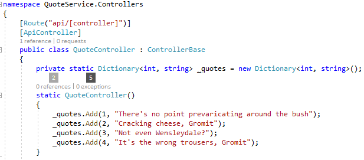
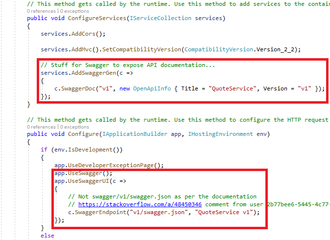
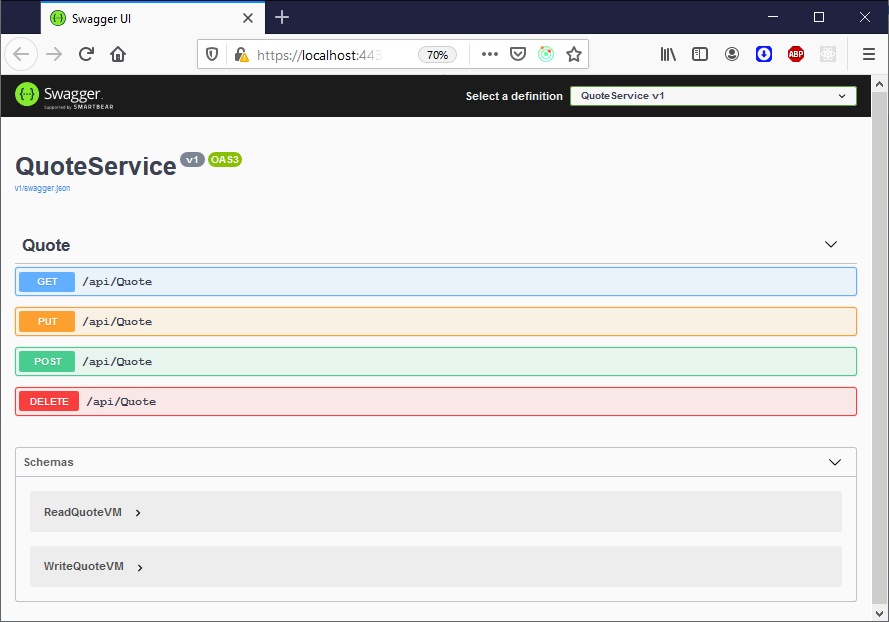
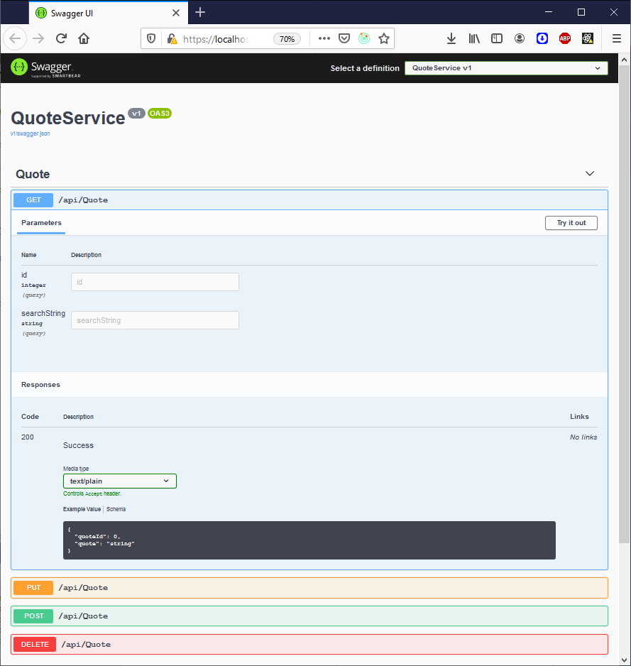
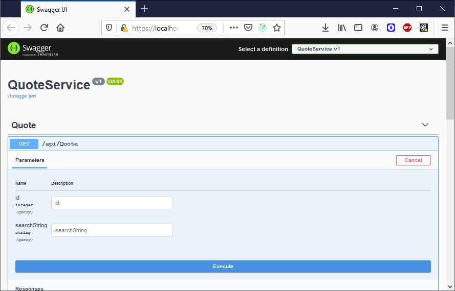
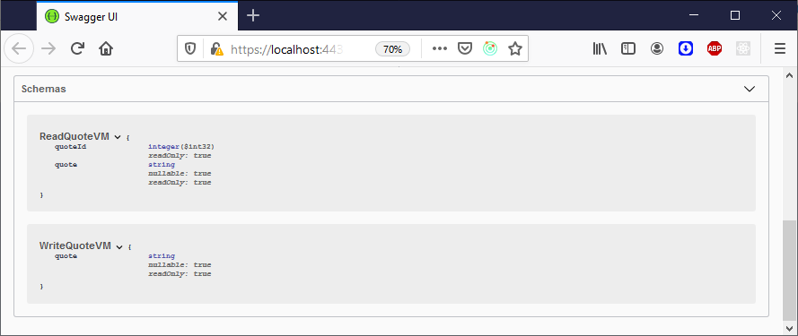
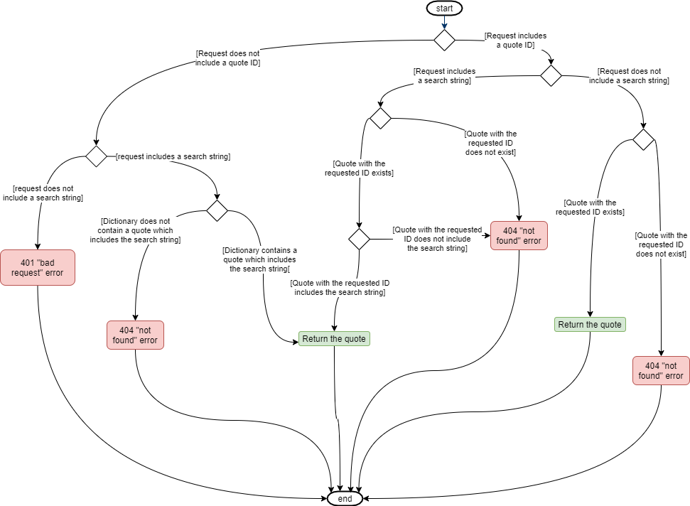
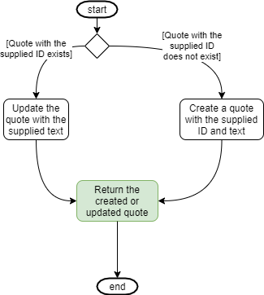
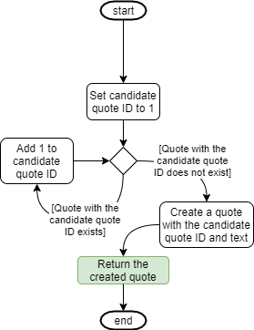
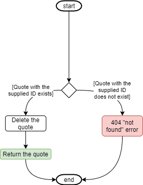

# The web API service

The web API service isn't the most important part of this application, it's just a service which can be called from the client application. The important bit is the client application, specifically how the client makes calls to the web API service, and how that client-side code can be tested. However, here's a quick functional walkthrough of the web API service, to help put the client application in context.

## Overview

The web API service is written in C# using the .net Core framework and the Model-View-Controller pattern. Because it's a web API rather than a UI, it doesn't have any views, and instead serves data for the client application to render into its pages.

It has a single controller, the QuoteController, which is used to manage an in-memory list of quotes from [Wallace and Gromit](https://en.wikipedia.org/wiki/Wallace_and_Gromit) movies (or any quotes you want, for that matter).

That's the only time we'll look at the server-side code, other than to note that I'm using the [Swashbuckle](https://docs.microsoft.com/en-us/aspnet/core/tutorials/getting-started-with-swashbuckle?view=aspnetcore-3.1&tabs=visual-studio) NuGet package so that when the project is debugged in Visual Studio, it launches a UI which shows the operations exposed by the service, and which can be used to make calls to the service. Swashbuckle is enabled by adding the following code to Startup.cs.

If you're interested in the server-side code, it's all there on GitHub.

When this project is run, it opens a browser window showing us the controllers exposed by the service, the verbs which can be used with them, and the schemas of the (view) models used to exchange data between the client and server.

So we have only one controller, at the route /api/Quote, which can respond to the GET, PUT, POST and DELETE verbs. We'll get to what each of those verbs does in a minute.

We also have two (view) models, a ReadQuoteVM and a WriteQuoteVM. We'll look at these in a bit.

### Using Swagger UI to call the web API service

Let's expand one of the verbs in the Swagger UI.

To use the Swagger UI to call the web API service, click the "Try it out" button. This gives us a form which can be used to construct a call to the service.

## (View) models

These are Data Transfer Objects used to exchange information between the client and the server. I'm not sure whether I should be calling them models or view models. When using the Model-View-Controller pattern in a server-side application which renders its own UI, they would be called view models. In documentation for MVC Core web API, they're often called models. I've chosen to call them view models. If you call them models then we'll just have to agree to disagree ;-)

### ReadQuoteVM

All the action methods in the QuoteController return a ReadQuoteVM. This is an object consisting of an integer quote ID and a string containing the text of the quote.

### WriteQuoteVM

Action methods which require information from the request body (in this case, POST and PUT) expect the body to contain this object. For this application, the object has only a single string property, but in real-world applications it could be a much more complex object.

## GET verb

The GET verb can accept two query string parameters; quote ID and search string.

If neither is provided then the request is rejected with a 401 error.

If only the quote ID is provided then the quote with that ID is returned, or if no quote with that ID exists then the request is rejected with a 404 error.

If only the search string is provided then the first quote containing the search string is returned, or if no quote contains the search string then the request is rejected with a 404 error.

If both quote ID and search string are provided then the quote with that ID is returned if the quote contains the search string, or if the quote does not contain the search string or no quote with the requested ID exists then the request is rejected with a 404 error.

## PUT verb

The PUT verb accepts a integer quote ID in the query string and a WriteQuoteVM in the request body. If a quote with the supplied ID already exists, it is updated with the text from the request body, and if it does not exist, it is created. In both cases the created or updated quote is returned.

## POST verb

The POST verb expects no query string parameters, but expects a WriteQuoteVM in the request body. It identifies the lowest unused quote ID which is greater than or equal to 1, and creates a new quote with that ID and the quote text from the request body. It then returns the created quote.

## DELETE verb

The DELETE verb expects a quote ID in the query string. If a quote with the supplied ID exists, it is deleted and the deleted quote is returned. If a quote with the supplied ID does not exist, the request is rejected with a 404 error.